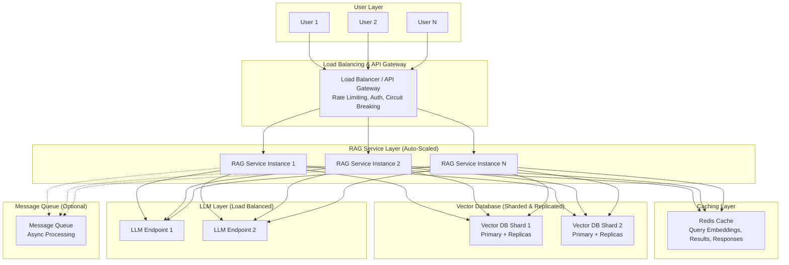

## 2.5 Scalability and Reliability in RAG Architecture

Building production-grade RAG systems for banking and enterprise environments requires careful attention to scalability and reliability. This section explores architectural patterns, best practices, and mitigation strategies to ensure your RAG system can handle high throughput, maintain availability, and gracefully handle failures.

### Designing for High Availability and Throughput

High availability (HA) and throughput are critical for RAG systems serving customer-facing applications or internal banking operations. A single point of failure or performance bottleneck can cascade into service disruptions, impacting user experience and potentially violating SLAs.

#### 1. Load Balancing and Horizontal Scaling

**Principle:** Distribute incoming requests across multiple instances of each RAG component to prevent overload and enable elastic scaling.

*   **API Gateway Layer:**
    *   **Industrial-Grade Aspect:** Deploy a robust API gateway (e.g., AWS API Gateway, Kong, NGINX) in front of your RAG service. This provides:
        *   **Load Distribution:** Round-robin, least-connections, or weighted routing across multiple RAG service instances.
        *   **Rate Limiting:** Protect backend services from overload by throttling requests per user/API key.
        *   **Authentication & Authorization:** Centralized security enforcement before requests reach RAG components.
        *   **Circuit Breaking:** Automatically stop sending requests to failing instances, preventing cascading failures.

*   **RAG Service Instances:**
    *   **Stateless Design:** Ensure your RAG orchestration layer (the component coordinating retrieval and generation) is stateless. This allows you to horizontally scale by adding more instances without session affinity concerns.
    *   **Auto-Scaling:** Use cloud-native auto-scaling groups (e.g., AWS Auto Scaling, Kubernetes HPA) to dynamically adjust the number of instances based on CPU, memory, or request queue depth metrics.
    *   **Industrial-Grade Aspect:** For banking, configure auto-scaling policies conservatively to handle traffic spikes (e.g., month-end reporting queries, regulatory filing deadlines) while maintaining cost efficiency during off-peak hours.

*   **Vector Database Scaling:**
    *   **Read Replicas:** Deploy read replicas of your vector database (e.g., Pinecone replicas, Milvus query nodes) to distribute search query load. Write operations (data ingestion) can be directed to primary nodes.
    *   **Sharding:** For extremely large knowledge bases (billions of vectors), partition data across multiple shards based on metadata (e.g., by department, document type, date range). This reduces the search space per query and improves latency.
    *   **Industrial-Grade Aspect:** In banking, sharding by business unit or regulatory domain can also enhance data isolation and access control.

#### 2. Caching Strategies

Caching is one of the most effective ways to improve throughput and reduce latency in RAG systems by avoiding redundant computations.

*   **Query Embedding Cache:**
    *   **Mechanism:** Cache the vector embeddings of frequently asked queries. If a user submits an identical or very similar query, retrieve the cached embedding instead of re-running the embedding model.
    *   **Implementation:** Use an in-memory cache (e.g., Redis, Memcached) with a TTL (time-to-live) policy. Key by a hash of the normalized query string.
    *   **Industrial-Grade Aspect:** For banking FAQs or common compliance questions, this can dramatically reduce embedding model load.

*   **Retrieval Result Cache:**
    *   **Mechanism:** Cache the top `K` retrieved document chunks for specific queries. If the same query is repeated, skip the vector search entirely.
    *   **Implementation:** Store in Redis with query hash as key and retrieved chunks as value. Set appropriate TTL based on how frequently your knowledge base updates.
    *   **Trade-off:** Stale cache entries may return outdated information if documents are updated. Implement cache invalidation strategies (e.g., invalidate cache for specific document IDs when they are re-indexed).
    *   **Industrial-Grade Aspect:** For static regulatory documents or historical data, longer TTLs are acceptable. For real-time market data or policy updates, shorter TTLs or event-driven invalidation are necessary.

*   **LLM Response Cache:**
    *   **Mechanism:** Cache the final generated response for identical queries and contexts. This is the most aggressive caching strategy.
    *   **Use Case:** Best suited for truly static FAQs or queries where the answer is deterministic and unlikely to change.
    *   **Industrial-Grade Aspect:** Use cautiously in banking. Ensure cached responses are reviewed for compliance and do not inadvertently provide outdated financial advice or regulatory guidance.

*   **Embedding Model Cache (Model Serving Layer):**
    *   **Mechanism:** If using a self-hosted embedding model, cache the model weights in GPU memory and use batching to process multiple queries simultaneously.
    *   **Industrial-Grade Aspect:** Reduces cold-start latency and improves GPU utilization.

#### 3. Asynchronous Processing and Queue Management

For non-real-time use cases or heavy workloads, decoupling request handling from processing improves resilience and throughput.

*   **Message Queues:**
    *   **Pattern:** Use a message queue (e.g., AWS SQS, RabbitMQ, Kafka) to buffer incoming RAG requests. Worker processes consume from the queue, execute the RAG workflow, and write results to a database or return them via a callback/webhook.
    *   **Benefits:**
        *   **Backpressure Handling:** Prevents overwhelming downstream services during traffic spikes.
        *   **Retry Logic:** Failed requests can be retried automatically with exponential backoff.
        *   **Prioritization:** Implement priority queues for critical queries (e.g., fraud detection alerts).
    *   **Industrial-Grade Aspect:** For batch processing of compliance reports or large-scale document analysis, asynchronous queues are essential.

*   **Streaming Responses:**
    *   **Pattern:** For LLM generation, use streaming APIs (e.g., OpenAI's streaming mode) to return partial responses to users incrementally, improving perceived latency.
    *   **Industrial-Grade Aspect:** Enhances user experience in chatbot interfaces, making the system feel more responsive.

#### 4. Multi-Region and Multi-AZ Deployment

**Principle:** Deploy RAG components across multiple availability zones (AZs) or geographic regions to ensure resilience against data center failures.

*   **Multi-AZ Deployment:**
    *   **Setup:** Distribute RAG service instances, vector database replicas, and LLM endpoints across at least two availability zones within a region.
    *   **Benefit:** Automatic failover if one AZ experiences an outage.
    *   **Industrial-Grade Aspect:** Standard practice for banking applications to meet uptime SLAs (e.g., 99.9% or higher).

*   **Multi-Region Deployment (Disaster Recovery):**
    *   **Setup:** Replicate your entire RAG stack (including vector database and knowledge base) to a secondary region. Use DNS-based failover (e.g., AWS Route 53 health checks) to redirect traffic if the primary region fails.
    *   **Trade-offs:** Increased cost and complexity. Data replication lag may result in slightly stale data in the secondary region.
    *   **Industrial-Grade Aspect:** Critical for global banking operations or regulatory requirements mandating geographic redundancy.

#### 5. Circuit Breakers and Fallback Mechanisms

**Principle:** Prevent cascading failures by isolating failing components and providing graceful degradation.

*   **Circuit Breaker Pattern:**
    *   **Implementation:** Use libraries like Hystrix (Java), resilience4j, or built-in features in service meshes (e.g., Istio) to wrap calls to external services (vector DB, LLM API).
    *   **Behavior:**
        *   **Closed State:** Requests flow normally.
        *   **Open State:** After a threshold of failures, the circuit "opens," and requests fail fast without calling the failing service.
        *   **Half-Open State:** After a timeout, the circuit allows a few test requests through. If they succeed, it closes; otherwise, it reopens.
    *   **Industrial-Grade Aspect:** Protects the RAG system from being dragged down by a slow or failing vector database or LLM provider.

*   **Fallback Strategies:**
    *   **Cached Responses:** If retrieval or generation fails, return a cached response (if available).
    *   **Simplified Retrieval:** Fall back to keyword search if vector search is unavailable.
    *   **Static Responses:** For critical errors, return a predefined, safe message (e.g., "Service temporarily unavailable. Please try again later.").
    *   **Industrial-Grade Aspect:** Ensures users receive *some* response rather than a hard error, maintaining a baseline level of service.

#### 6. Connection Pooling and Resource Management

**Principle:** Efficiently manage connections to databases and external APIs to prevent resource exhaustion.

*   **Database Connection Pools:**
    *   **Setup:** Use connection pooling libraries (e.g., HikariCP for Java, SQLAlchemy pooling for Python) for vector databases and metadata stores.
    *   **Benefit:** Reuses existing connections instead of opening/closing for each request, reducing overhead and latency.
    *   **Configuration:** Tune pool size based on expected concurrency and database capacity.

*   **HTTP Client Pooling:**
    *   **Setup:** For calls to LLM APIs (e.g., OpenAI, Anthropic), use HTTP client libraries with connection pooling and keep-alive enabled.
    *   **Benefit:** Reduces TLS handshake overhead for repeated API calls.

*   **Resource Limits:**
    *   **Industrial-Grade Aspect:** Set memory and CPU limits for RAG service containers (e.g., in Kubernetes) to prevent a single runaway process from consuming all resources and impacting other services.

**Scalable RAG Architecture Diagram:**

### Potential Bottlenecks and Mitigation

Even with a well-architected system, specific components can become bottlenecks under load. Identifying and mitigating these is crucial for maintaining performance.

#### 1. Vector Database Query Performance

**Bottleneck Symptoms:**
*   High query latency (p95, p99 latencies increasing)
*   Vector database CPU/memory saturation
*   Slow response times for retrieval step

**Root Causes:**
*   **Large Index Size:** Searching billions of vectors is computationally expensive, even with ANN algorithms.
*   **High Dimensionality:** Embeddings with very high dimensions (e.g., 1536, 3072) increase search complexity.
*   **Insufficient Indexing:** Not using optimized index types (e.g., HNSW, IVF) or poorly tuned index parameters.
*   **Cold Start:** Index not fully loaded into memory after a restart.

**Mitigation Strategies:**
*   **Optimize Index Type and Parameters:** Use HNSW for low latency or IVF for large-scale datasets. Tune parameters like `ef_construction`, `M` (HNSW), or `nlist`, `nprobe` (IVF) based on your latency/recall trade-off.
*   **Metadata Filtering:** Apply filters (e.g., by document type, date, user permissions) *before* vector search to reduce the search space. Ensure your vector DB supports efficient filtered search.
*   **Dimensionality Reduction:** Use embedding models with lower dimensions (e.g., 384, 768) if acceptable for your use case, or apply PCA/quantization techniques.
*   **Sharding:** Partition the vector database across multiple nodes/shards.
*   **Upgrade Hardware:** Use instances with more CPU cores, RAM, or GPU acceleration (if supported by your vector DB).
*   **Warm-up Queries:** After deployment, run a set of warm-up queries to ensure the index is fully loaded into memory.
*   **Industrial-Grade Aspect:** For banking, prioritize recall over extreme speed. A 200ms retrieval latency is acceptable if it ensures comprehensive, accurate results for compliance queries.

#### 2. Embedding Model Inference Latency

**Bottleneck Symptoms:**
*   Slow query embedding generation
*   High GPU utilization or queuing for embedding model
*   Increased end-to-end latency for user queries

**Root Causes:**
*   **Model Size:** Large embedding models (e.g., multi-billion parameter models) are slower to run.
*   **CPU-Only Inference:** Running embedding models on CPU instead of GPU.
*   **Single-Threaded Processing:** Not batching multiple queries for parallel embedding.
*   **Cold Start:** Model loading time on first request.

**Mitigation Strategies:**
*   **Use Smaller, Efficient Models:** Choose embedding models optimized for speed (e.g., `all-MiniLM-L6-v2` for general use, or domain-specific smaller models).
*   **GPU Acceleration:** Deploy embedding models on GPU instances (e.g., AWS g4dn, g5 instances). Use frameworks like ONNX Runtime or TensorRT for optimized inference.
*   **Batching:** Accumulate multiple embedding requests and process them in a single batch to maximize GPU utilization.
*   **Model Caching:** Keep the embedding model loaded in memory (avoid reloading on each request).
*   **Dedicated Embedding Service:** Deploy a separate, auto-scaled microservice for embedding generation (e.g., using Hugging Face Text Embeddings Inference, or a custom FastAPI service).
*   **Quantization:** Use model quantization (e.g., INT8) to reduce model size and inference time with minimal accuracy loss.
*   **Industrial-Grade Aspect:** For banking, ensure embedding model performance is benchmarked under peak load scenarios (e.g., end-of-quarter reporting).

#### 3. LLM Generation Bottlenecks

**Bottleneck Symptoms:**
*   Long time-to-first-token (TTFT) or time-to-completion for LLM responses
*   LLM API rate limits being hit
*   High costs due to excessive token usage

**Root Causes:**
*   **Large Context Windows:** Sending very long prompts (e.g., 10,000+ tokens) increases processing time.
*   **Model Size:** Larger LLMs (e.g., GPT-4, Claude Opus) are slower than smaller models.
*   **API Rate Limits:** Exceeding requests-per-minute or tokens-per-minute limits from LLM providers.
*   **Synchronous Blocking:** Waiting for full LLM response before returning anything to the user.

**Mitigation Strategies:**
*   **Prompt Optimization:** Minimize prompt length by:
        *   Retrieving only the most relevant `K` chunks (e.g., top 3-5 instead of top 10).
        *   Summarizing or truncating very long retrieved chunks.
        *   Using concise system instructions.
*   **Use Faster Models:** For simpler queries, route to smaller, faster LLMs (e.g., GPT-3.5-turbo, Claude Haiku). Implement query classification to determine which model to use.
*   **Streaming Responses:** Use streaming APIs to return partial responses incrementally, improving perceived latency.
*   **Increase Rate Limits:** Negotiate higher rate limits with LLM providers or use multiple API keys to distribute load.
*   **Self-Hosted LLMs:** For extremely high throughput or data sovereignty requirements, deploy self-hosted LLMs (e.g., Llama 3, Mistral) on dedicated GPU infrastructure. Use vLLM or TGI for optimized serving.
*   **Response Caching:** Cache LLM responses for frequently asked questions (with appropriate TTL and invalidation).
*   **Industrial-Grade Aspect:** For banking, balance speed with quality. Use larger, more capable models for complex regulatory queries, and faster models for simple FAQs.

#### 4. Network I/O Constraints

**Bottleneck Symptoms:**
*   High network latency between RAG components
*   Timeouts when calling external APIs (vector DB, LLM)
*   Bandwidth saturation

**Root Causes:**
*   **Geographic Distance:** RAG service in one region, vector DB or LLM in another.
*   **Large Payload Sizes:** Transferring large amounts of data (e.g., many retrieved chunks, long prompts).
*   **Insufficient Bandwidth:** Network link capacity exceeded.

**Mitigation Strategies:**
*   **Co-location:** Deploy RAG components (service, vector DB, LLM) in the same cloud region and availability zone to minimize latency.
*   **Compression:** Enable HTTP compression (gzip, brotli) for API calls.
*   **Reduce Payload Size:** Retrieve fewer chunks, truncate long documents, or use summarization.
*   **CDN for Static Assets:** If serving a web UI, use a CDN to cache static assets.
*   **Upgrade Network Tier:** Use cloud provider's premium network tiers for lower latency (e.g., AWS Global Accelerator).
*   **Industrial-Grade Aspect:** For multi-region banking deployments, use dedicated network connections (e.g., AWS Direct Connect) for low-latency, secure communication.

#### 5. Memory Management Issues

**Bottleneck Symptoms:**
*   Out-of-memory (OOM) errors in RAG service or vector DB
*   Excessive garbage collection pauses (for JVM-based systems)
*   Swapping to disk, causing severe performance degradation

**Root Causes:**
*   **Large In-Memory Caches:** Unbounded caches consuming all available RAM.
*   **Memory Leaks:** Unreleased objects accumulating over time.
*   **Large Batch Sizes:** Processing too many queries or documents simultaneously.

**Mitigation Strategies:**
*   **Set Cache Size Limits:** Configure maximum memory usage for Redis or in-process caches (e.g., LRU eviction policies).
*   **Tune Garbage Collection:** For JVM applications, tune GC settings (e.g., use G1GC or ZGC for low-latency).
*   **Monitor Memory Usage:** Use observability tools (Prometheus, Datadog) to track memory consumption and set alerts.
*   **Horizontal Scaling:** Add more instances instead of vertically scaling (increasing RAM per instance).
*   **Batch Size Tuning:** Reduce batch sizes for embedding or LLM inference if memory is constrained.
*   **Industrial-Grade Aspect:** Implement memory profiling in staging environments to identify leaks before production deployment.

#### 6. Token Limit Constraints

**Bottleneck Symptoms:**
*   Errors due to exceeding LLM context window (e.g., "maximum context length exceeded")
*   Truncated or incomplete responses

**Root Causes:**
*   **Too Many Retrieved Chunks:** Retrieving 10+ long chunks exceeds the LLM's token limit.
*   **Long Documents:** Individual chunks are very large.
*   **Verbose System Instructions:** Overly detailed prompts.

**Mitigation Strategies:**
*   **Dynamic Chunk Selection:** Retrieve top `N` chunks, then iteratively add them to the prompt until you approach the token limit. Prioritize by relevance score.
*   **Chunk Summarization:** Use a smaller LLM to summarize retrieved chunks before sending to the main LLM.
*   **Sliding Window:** For very long documents, use a sliding window approach to process sections sequentially.
*   **Use Models with Larger Context Windows:** Upgrade to models with 32k, 100k, or 200k token limits (e.g., GPT-4 Turbo, Claude 3 Opus, Gemini 1.5 Pro).
*   **Prompt Compression:** Use techniques like LLMLingua to compress prompts while retaining key information.
*   **Industrial-Grade Aspect:** For banking, ensure critical information (e.g., regulatory clauses) is always included in the prompt, even if less relevant chunks are truncated.

**Summary of Bottlenecks and Mitigations:**

| **Bottleneck**               | **Primary Mitigation**                          | **Secondary Mitigation**                  |
|------------------------------|-------------------------------------------------|-------------------------------------------|
| Vector DB Query Performance  | Optimize index type/parameters, metadata filters | Sharding, dimensionality reduction        |
| Embedding Model Latency      | GPU acceleration, batching                      | Use smaller models, dedicated service     |
| LLM Generation               | Prompt optimization, streaming                  | Use faster models, self-hosted LLMs       |
| Network I/O                  | Co-locate components in same region/AZ          | Compression, reduce payload size          |
| Memory Management            | Set cache limits, horizontal scaling            | Tune GC, monitor memory usage             |
| Token Limit Constraints      | Dynamic chunk selection, larger context models  | Chunk summarization, prompt compression   |

### Best Practices for Production RAG Systems

1.  **Observability is Non-Negotiable:** Instrument every component with metrics (latency, throughput, error rates), logs, and traces. Use tools like Prometheus, Grafana, ELK stack, or cloud-native solutions (AWS CloudWatch, Azure Monitor).
2.  **Chaos Engineering:** Regularly test failure scenarios (e.g., vector DB outage, LLM API downtime) to validate circuit breakers and fallback mechanisms.
3.  **Cost Optimization:** Monitor LLM token usage and vector DB query costs. Implement caching and query optimization to reduce expenses without sacrificing quality.
4.  **Security and Compliance:** Ensure data encryption in transit and at rest, implement robust access controls, and audit all RAG interactions for compliance (especially in banking).
5.  **Continuous Performance Testing:** Establish baseline performance benchmarks and run load tests before each deployment to catch regressions early.

By applying these scalability and reliability patterns, you can build RAG systems that meet the demanding requirements of banking and enterprise environments, delivering consistent, high-quality responses even under heavy load and adverse conditions.
