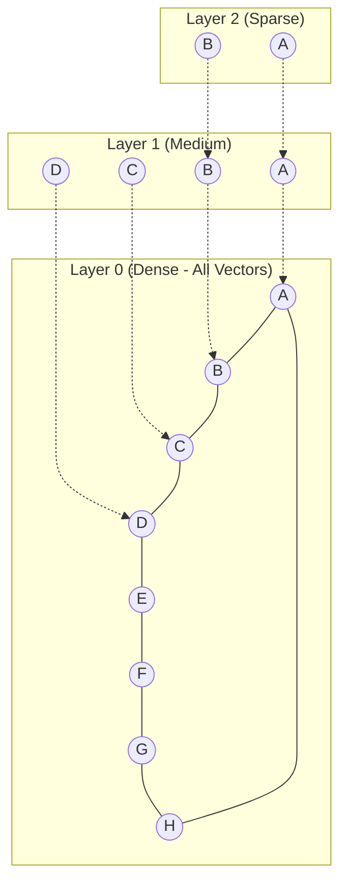

## 3.3 Indexing Strategies (HNSW, IVF, Product Quantization)

Efficient vector search at scale requires sophisticated indexing algorithms. This section explores the most important indexing strategies—HNSW, IVF, and quantization techniques—that enable sub-second queries across millions or billions of vectors.

### The Challenge of High-Dimensional Search

**Brute-Force Search:**
*   **Method:** Calculate distance between query vector and every vector in the database
*   **Complexity:** O(N × D) where N = number of vectors, D = dimensions
*   **Problem:** Infeasible for large datasets (e.g., 1M vectors × 768 dims = 768M distance calculations per query)

**Solution:** Approximate Nearest Neighbor (ANN) algorithms trade perfect accuracy for speed, achieving >95% recall with 10-100x faster queries.

### HNSW (Hierarchical Navigable Small World)

**Overview:** HNSW is currently the most popular indexing algorithm, offering excellent recall-latency trade-offs.

#### How HNSW Works

HNSW builds a multi-layer graph structure:

1.  **Layer 0 (Base Layer):** Contains all vectors, densely connected
2.  **Upper Layers:** Progressively sparser, containing subset of vectors for fast navigation
3.  **Search Process:**
    *   Start at top layer, find closest nodes
    *   Navigate down layers, refining search
    *   At base layer, perform local search for final k-NN

**Analogy:** Like navigating a city—use highways (upper layers) for long distances, then local roads (base layer) for final destination.



#### Key Parameters

**1. M (Max Connections per Layer)**
*   **Description:** Maximum number of edges per node in each layer
*   **Typical Values:** 16-64
*   **Trade-off:**
    *   Higher M → Better recall, more memory, slower indexing
    *   Lower M → Faster indexing, less memory, lower recall

**2. ef_construction (Exploration Factor during Build)**
*   **Description:** Size of dynamic candidate list during index construction
*   **Typical Values:** 100-500
*   **Trade-off:**
    *   Higher ef_construction → Better index quality, slower build time
    *   Lower ef_construction → Faster build, potentially lower recall

**3. ef_search (Exploration Factor during Query)**
*   **Description:** Size of dynamic candidate list during search
*   **Typical Values:** 50-500
*   **Trade-off:**
    *   Higher ef_search → Better recall, slower queries
    *   Lower ef_search → Faster queries, lower recall

#### Tuning HNSW for Banking RAG

**Example Configuration (Qdrant):**
```json
{
  "hnsw_config": {
    "m": 32,
    "ef_construct": 200,
    "full_scan_threshold": 10000
  }
}
```

**Query-time tuning:**
```python
search_params = {
    "hnsw_ef": 128,  # Higher for critical compliance queries
    "exact": False
}
```

**Industrial-Grade Aspect:** For banking, prioritize recall over speed for compliance queries. Use `ef_search=200-500` and `M=32-64` to ensure regulatory documents are not missed. For customer support chatbots, lower values (ef_search=50-100) may suffice.

#### Advantages and Limitations

**Advantages:**
*   Excellent recall-latency balance (>95% recall with \<100ms latency)
*   Incremental updates supported (add/delete vectors without full rebuild)
*   Works well across different dimensionalities

**Limitations:**
*   Memory-intensive (stores full graph in RAM)
*   Not ideal for extremely high-dimensional data (>2048 dims)
*   Performance degrades if index doesn't fit in memory

### IVF (Inverted File Index)

**Overview:** IVF partitions the vector space into clusters (Voronoi cells), enabling faster search by querying only relevant clusters.

#### How IVF Works

1.  **Training Phase:**
    *   Use k-means clustering to partition vectors into `nlist` clusters
    *   Each cluster has a centroid
2.  **Indexing Phase:**
    *   Assign each vector to nearest cluster
    *   Store vectors in inverted lists (one per cluster)
3.  **Search Phase:**
    *   Find `nprobe` nearest cluster centroids to query
    *   Search only vectors in those clusters

**Analogy:** Like organizing a library by topic—search only relevant sections instead of every book.

#### Key Parameters

**1. nlist (Number of Clusters)**
*   **Description:** How many partitions to create
*   **Typical Values:** sqrt(N) to 4×sqrt(N), where N = number of vectors
*   **Example:** For 1M vectors, use 1000-4000 clusters

**2. nprobe (Number of Clusters to Search)**
*   **Description:** How many clusters to query
*   **Typical Values:** 1-256
*   **Trade-off:**
    *   Higher nprobe → Better recall, slower queries
    *   Lower nprobe → Faster queries, lower recall

#### IVF Variants

**IVF-Flat:**
*   Stores full vectors (no compression)
*   Highest accuracy, moderate speed
*   Use when memory is not constrained

**IVF-PQ (with Product Quantization):**
*   Compresses vectors using quantization
*   Lower memory, faster search, slight accuracy loss
*   Covered in detail below

**IVF-HNSW:**
*   Uses HNSW for coarse search (finding clusters)
*   Combines benefits of both algorithms
*   Available in FAISS

#### Tuning IVF for Banking RAG

**Example Configuration (FAISS):**
```python
import faiss

# For 1M vectors, 768 dimensions
nlist = 2000  # Number of clusters
quantizer = faiss.IndexFlatL2(768)
index = faiss.IndexIVFFlat(quantizer, 768, nlist)

# Training
index.train(training_vectors)

# Query-time tuning
index.nprobe = 64  # Search 64 clusters
```

**Industrial-Grade Aspect:** IVF is memory-efficient and works well for very large datasets. For banking, use higher `nprobe` values (64-128) for critical queries to ensure comprehensive search.

#### Advantages and Limitations

**Advantages:**
*   Memory-efficient (especially with quantization)
*   Scales to billions of vectors
*   Faster than brute-force by orders of magnitude

**Limitations:**
*   Requires training phase (need representative sample)
*   Recall can be lower than HNSW for same latency
*   Static index (updates require rebuilding or merging)

### Product Quantization (PQ)

**Overview:** Product Quantization compresses vectors by splitting them into subvectors and quantizing each independently, dramatically reducing memory usage.

#### How Product Quantization Works

1.  **Split Vector:** Divide D-dimensional vector into M subvectors of D/M dimensions each
2.  **Codebook Training:** For each subvector position, create a codebook of K representative vectors (using k-means)
3.  **Encoding:** Replace each subvector with its nearest codebook entry's ID
4.  **Storage:** Store only codebook IDs (e.g., 8 bits per subvector instead of 32 bits × D/M)

**Example:**
*   Original: 768-dim vector × 4 bytes/float = 3072 bytes
*   PQ (M=96, K=256): 96 subvectors × 1 byte = 96 bytes
*   **Compression Ratio:** 32x smaller!

#### Key Parameters

**1. M (Number of Subvectors)**
*   **Description:** How many pieces to split vector into
*   **Typical Values:** 8, 16, 32, 64, 96
*   **Constraint:** D must be divisible by M

**2. nbits (Bits per Subvector)**
*   **Description:** Size of codebook (K = 2^nbits)
*   **Typical Values:** 8 bits (256 codebook entries)
*   **Trade-off:** More bits → better accuracy, less compression

#### Tuning PQ for Banking RAG

**Example Configuration (FAISS):**
```python
import faiss

# For 768-dim vectors
M = 96  # 96 subvectors of 8 dims each
nbits = 8  # 256-entry codebooks

# Create IVF-PQ index
nlist = 2000
quantizer = faiss.IndexFlatL2(768)
index = faiss.IndexIVFPQ(quantizer, 768, nlist, M, nbits)

# Training
index.train(training_vectors)
```

**Industrial-Grade Aspect:** PQ is essential for banks with massive document repositories (millions of documents). The 10-30x memory reduction enables fitting entire knowledge bases in RAM, dramatically improving query speed.

#### Advantages and Limitations

**Advantages:**
*   Massive memory savings (10-50x compression)
*   Faster search (less data to process)
*   Enables larger indexes to fit in RAM

**Limitations:**
*   Accuracy loss (typically 5-15% lower recall)
*   Requires training phase
*   Not suitable when perfect accuracy is required

### Scalar Quantization (SQ)

**Overview:** Simpler than PQ, scalar quantization reduces precision of each vector component.

**Method:**
*   Convert float32 (4 bytes) to int8 (1 byte) or int4 (0.5 bytes)
*   Store min/max values for dequantization

**Compression:** 4x (int8) or 8x (int4)

**Use Case:** When you need some compression but want better accuracy than PQ.

**Industrial-Grade Aspect:** Scalar quantization is a good middle ground for banking—significant memory savings with minimal accuracy loss (\<2% recall degradation).

### Indexing Strategy Decision Matrix

| Index Type | Memory | Speed | Accuracy | Best For |
|------------|--------|-------|----------|----------|
| **Flat (Brute-Force)** | High | Slow | 100% | \<10K vectors, ground truth |
| **HNSW** | High | Fast | 95-99% | General-purpose, incremental updates |
| **IVF-Flat** | Medium | Medium | 90-95% | Large datasets, batch updates |
| **IVF-PQ** | Low | Fast | 85-92% | Massive scale, memory-constrained |
| **IVF-HNSW** | Medium | Very Fast | 95-98% | Best of both worlds |
| **Scalar Quantization** | Medium | Fast | 93-97% | Balance of compression and accuracy |

### Hybrid Indexing Approaches

**1. Tiered Indexing:**
*   **Recent Documents:** HNSW (high accuracy, frequent updates)
*   **Archive:** IVF-PQ (memory-efficient, infrequent updates)

**2. Query-Adaptive:**
*   **Critical Queries:** Use exact search or high ef_search
*   **Routine Queries:** Use approximate search with lower parameters

**3. Multi-Index:**
*   **Coarse Search:** IVF to narrow down candidates
*   **Fine Search:** HNSW on candidate subset

**Industrial-Grade Aspect:** Large banks often use tiered indexing—HNSW for current regulatory documents (updated frequently) and IVF-PQ for historical archives (rarely updated, massive scale).

### Benchmarking and Tuning

**Metrics to Track:**
*   **Recall@K:** Percentage of true top-K results found
*   **Latency:** p50, p95, p99 query times
*   **Throughput:** Queries per second (QPS)
*   **Memory Usage:** Index size in RAM
*   **Build Time:** Time to construct index

**Tuning Process:**
1.  **Baseline:** Start with default parameters
2.  **Measure:** Benchmark on representative queries
3.  **Iterate:** Adjust parameters to meet SLAs
4.  **Validate:** Test on production-like data

**Example SLA for Banking:**
*   Recall@10 ≥ 95%
*   p95 latency ≤ 200ms
*   Support 100 QPS per instance

### Summary

Indexing strategies are crucial for production RAG performance. Key takeaways:

*   **HNSW** is the current state-of-the-art for most use cases
*   **IVF** excels for massive scale and memory efficiency
*   **Product Quantization** enables 10-30x compression with acceptable accuracy loss
*   **Banking priorities:** High recall for compliance, balanced with cost-effective scaling
*   **Hybrid approaches** optimize for different document types and query patterns
*   **Continuous benchmarking** ensures SLAs are met as data grows

In the next section, we'll explore how to select and fine-tune embedding models for your specific domain.
